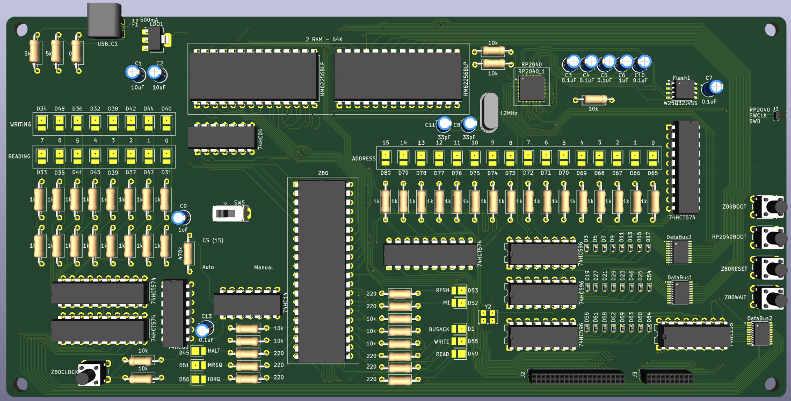
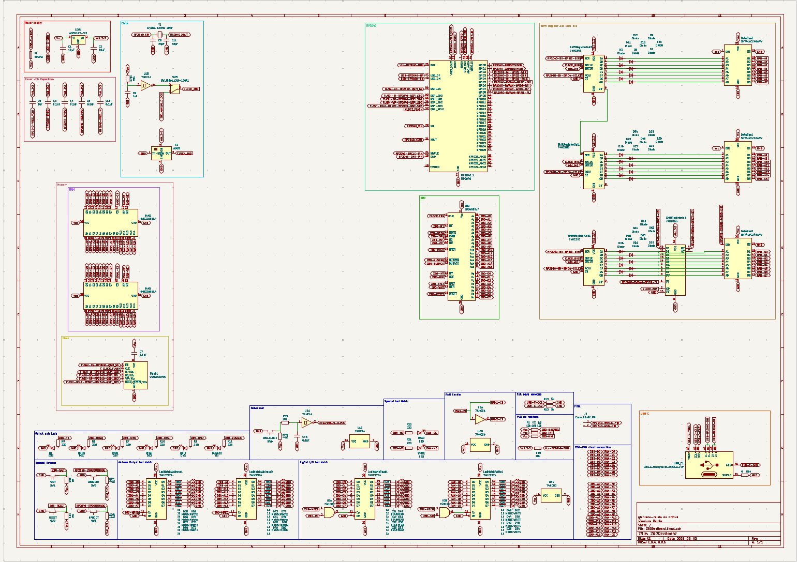
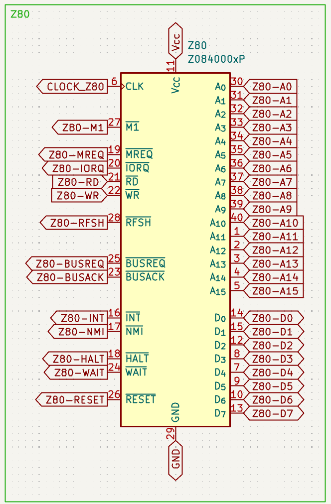
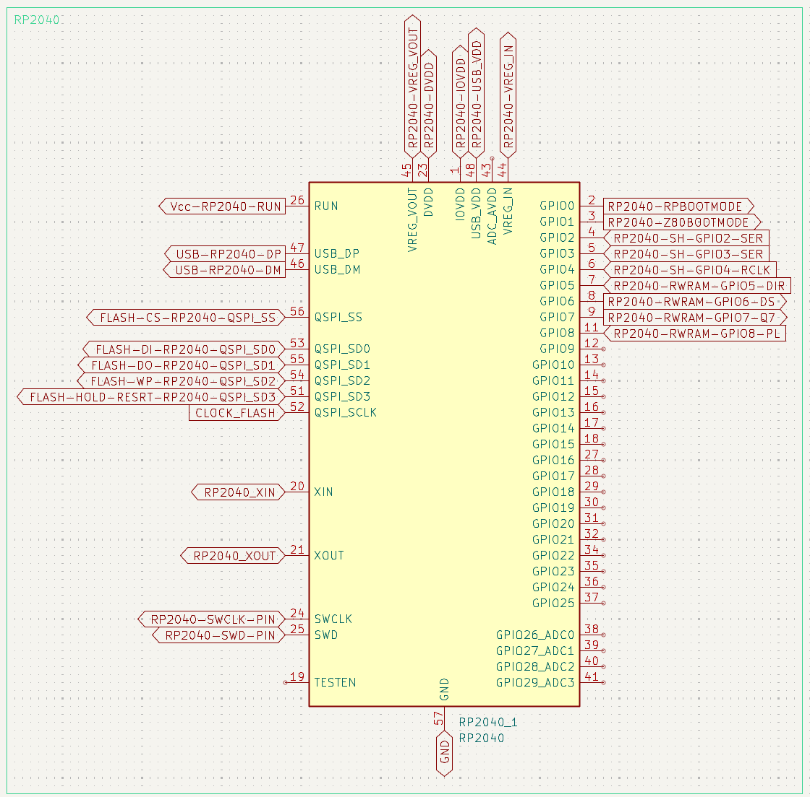
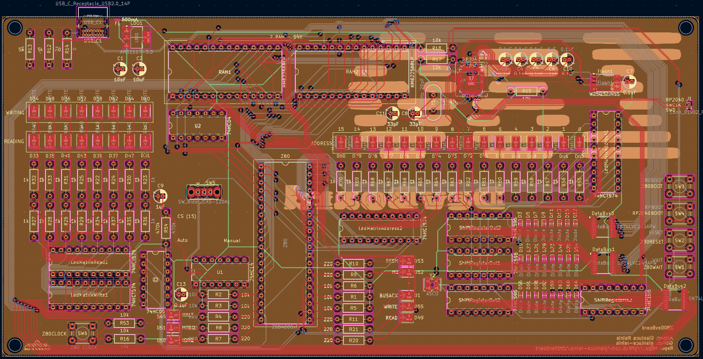
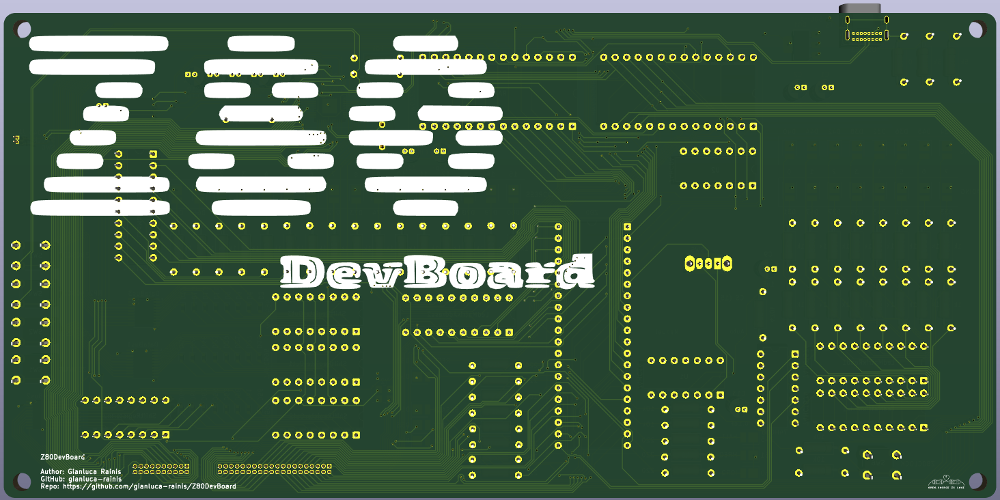

# Z80DevBoard
An advanced development board for the Z80 (Specific model: Z8400).

It's powered by an RP2040.
It have a flash memory where you can write the RP2040 firmware and the Z80 program.
The RP2040 load in the RAM the Z80 program and the Z80 run it.
The leds allow you to see the real time actions of the Z80.

---

## Author
Gianluca Rainis (gianluca-rainis on GitHub)

## License
The whole project is under the MIT License.

## Developing tools
- KiCad

## Components
- Z8400
- RP2040
- USB C 2.0 port
- HM62256BLP (RAM)
- W25Q32JVSS (Flash)
- Crystal oscillator
- AMS1117-3.3 (5V to 3v3)
- 3 74HC595 (Serial to 8 bit)
- 74HC165 (8 bit to Serial)
- 3 SN74LVC245APW (Bus to handle the voltage differences)
- 4 Buttons
- 40 Leds
- 24 Diods
- Resistor 0 ohm
- 40 Resistors 220 ohm
- 2 Resistors 5k ohm
- 9 Resistors 10k ohm
- 5 Capacitors 0.1uF
- Capacitor 1uF
- 2 Capacitors 10uF
- Fuse 500mA

## Images
### Scheme (A2 format)

### Z80 scheme

### RP2040 scheme

### Pcb view

### 3D Front view

### 3D Back view

