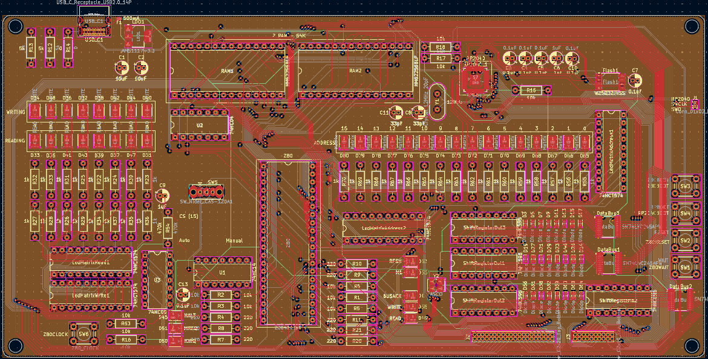

# Z80DevBoard
An advanced development board for the Z80 microprocessor (Specific model: Z8400), powered by an RP2040.

This development board combines the classic Z8400 (Z80) microprocessor with a modern RP2040 microcontroller. The RP2040 manages flash memory storage and loads programs into RAM for the Z80 to execute. Real-time LED indicators provide visual feedback of the Z80's operations, making it an excellent educational and development tool.


---


## Author
**Gianluca Rainis** - [gianluca-rainis](https://github.com/gianluca-rainis)

## License
Hardware design files (schematics, PCB, BOM):
Licensed under [CERN-OHL-W v2.0](LICENSE-CERN-OHL-W.md)

Software and firmware:
Licensed under the [MIT License](LICENSE-MIT.md)

## AI Disclaimer
No AI was used in this project. Everything was designed by the author.

## Development Tools
- **PCB Design:** KiCad

## PCB Manufacturing
The Gerber files for PCB manufacturing are available in the [`gerber/`](gerber/) directory.

## Components
### Microprocessors
- Z8400
- RP2040

### Memory
- HM62256BLP (RAM)
- W25Q32JVSS (Flash)

### Power Management
- AMS1117-3.3 (5V to 3v3)

### Data Bus
- USB C 2.0 port
- 3 74HC595 (Serial to 8 bit)
- 74HC165 (8 bit to Serial)
- 3 SN74LVC245APW (Bus to handle the voltage differences)
- Connector 2 pins

### Support components
- Crystal 12MHz
- 2 oscillators 10KHz

### Resistors
- Resistor 0 ohm
- 40 Resistors 220 ohm
- 2 Resistors 5k ohm
- 9 Resistors 10k ohm

### Capacitors
- 2 Capacitors 12pF
- 8 Capacitors 0.1uF
- Capacitor 1uF
- 2 Capacitors 10uF

### Other
- 4 Buttons
- 40 LEDs
- 24 Diodes
- Fuse 500mA

## Project Structure
```
Z80DevBoard/
├── gerber/                 # PCB manufacturing files (Gerber format)
├── images/                 # Documentation images and KiCad symbols
├── .gitattributes          # Gitattributes file
├── .gitignore              # Gitignore file
├── Z80DevBoard.kicad_pcb   # PCB layout file
├── Z80DevBoard.kicad_pro   # KiCad project file
├── Z80DevBoard.kicad_sch   # Schematic file
├── LICENSE-MIT.md          # MIT License
├── LICENSE-CERN-OHL-W.md   # CERN-OHL-W License
└── README.md               # This file
```

## Images
### Schematic Diagrams
#### Complete Schematic (A2 format)


#### Z80 Section


#### RP2040 Section


### PCB Layout
#### Without Silkscreen


#### With Silkscreen


### 3D Renders
#### Front View


#### Back View
