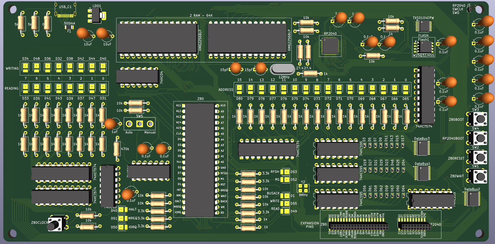
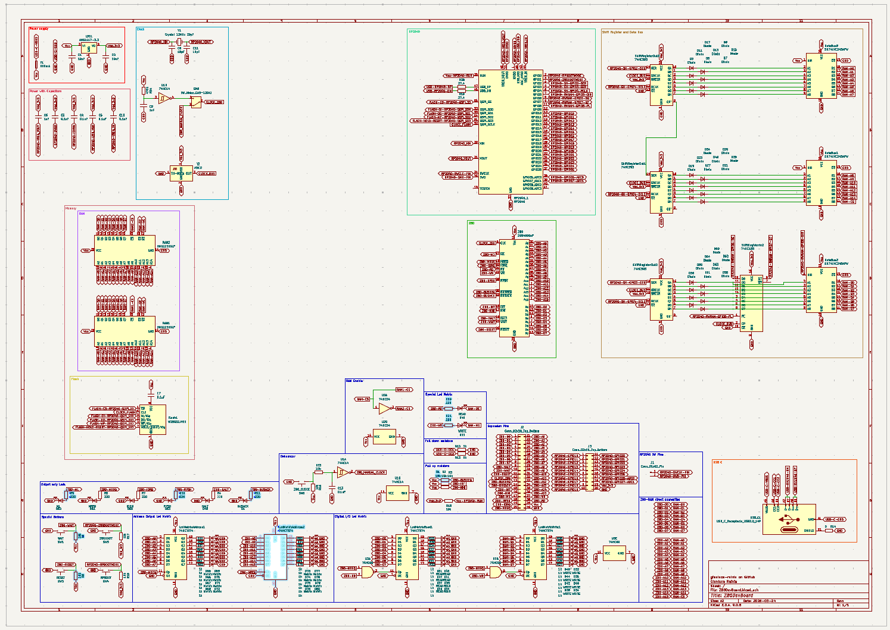
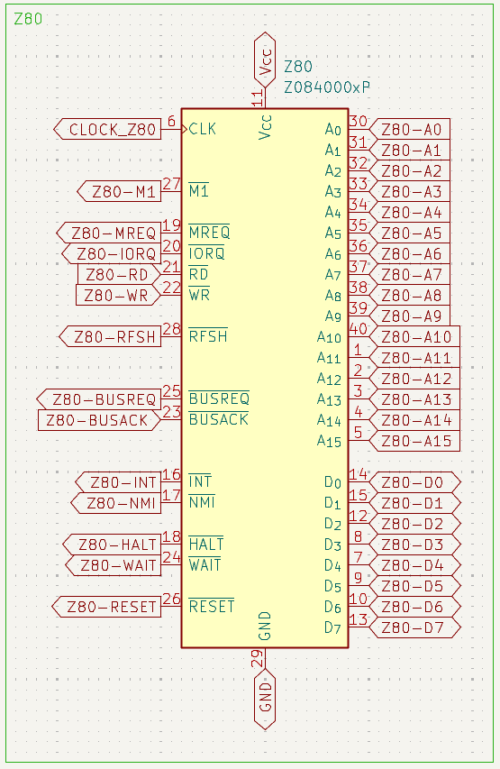
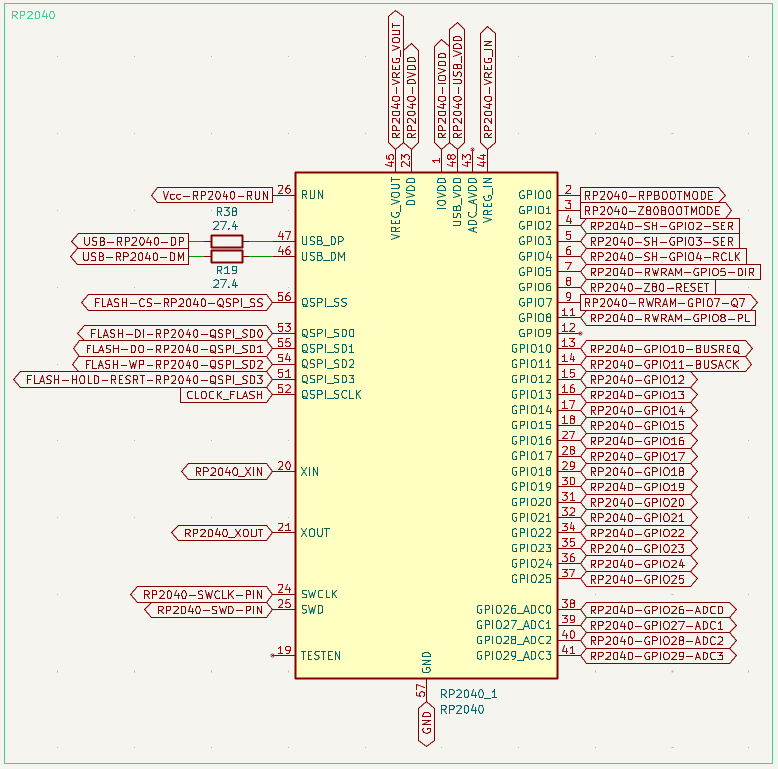
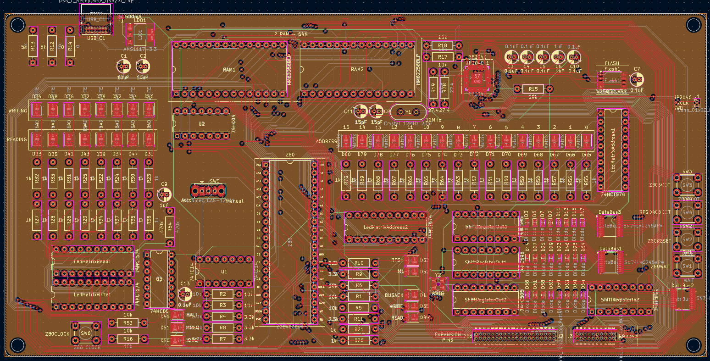
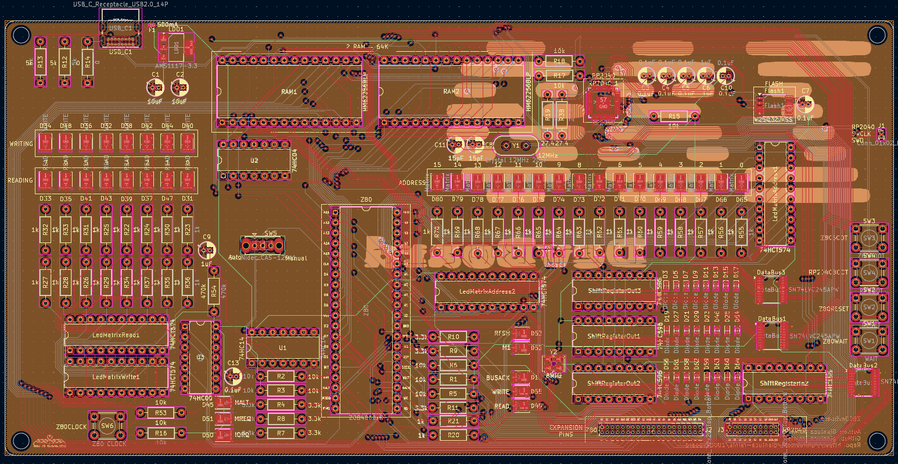
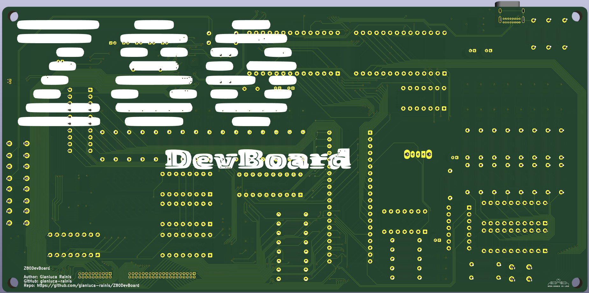

# Z80DevBoard
An advanced development board for the Z80 microprocessor (specific model: Z84C00), powered by an RP2040.

This board combines the classic Z80 with a modern RP2040 microcontroller. The RP2040 handles flash storage and loads programs into RAM for the Z80 to execute. Real-time LED indicators provide visual feedback of Z80 activity, making the platform ideal for both learning and development.


---



## Author
The author of the whole project is: 
**Gianluca Rainis** - [gianluca-rainis](https://github.com/gianluca-rainis) on GitHub.

## License
### Hardware design files (schematics, PCB, BOM):
Licensed under [CERN-OHL-S v2.0](LICENSE-CERN-OHL-S.md)

### Software and firmware:
Licensed under the [MIT License](LICENSE-MIT.md)

## AI Disclaimer
No AI was used in this project. Everything was designed by the author.

## Development Tools
- **PCB Design:** KiCad
- **Documentation and code:** Visual Studio Code

## PCB Manufacturing
The Gerber files for PCB manufacturing are available in the [`gerber/`](gerber/) directory.

## Components
### Microprocessors
- 1 Z84C00
- 1 RP2040

### Memory
- 2 HM62256BLP (RAM)
- 1 W25Q32JVSS (Flash)

### Power Management
- 1 AMS1117-3.3 (5V to 3v3)

### Data Bus
- 1 USB C 2.0 port
- 3 74HC595 (Serial to 8 bit)
- 1 74HC165 (8 bit to Serial)
- 4 74HCT574 (8 bit Buffer)
- 3 SN74LVC245APW (Bus to handle the voltage differences)
- 1 Connector 2 pins
- 1 Connector 2x20 pins
- 1 Connector 2x10 pins

### Support components
- 1 Crystal 12MHz 20pF
- 1 Oscillator 2MHz
- 1 74HC14
- 1 74HC04
- 1 74HC00

### Resistors
- 1 Resistor 0 ohm
- 8 Resistors 220 ohm
- 32 Resistors 1k ohm
- 2 Resistors 5k ohm
- 10 Resistors 10k ohm
- 1 Resistor 470k ohm

### Capacitors
- 2 Capacitors 33pF
- 6 Capacitors 0.1uF
- 3 Capacitor 1uF
- 2 Capacitors 10uF

### Other
- 5 Buttons
- 1 Switch
- 40 LEDs
- 24 Diodes
- 1 Fuse 500mA

## Project Structure
```
Z80DevBoard/
├── gerber/                 # PCB manufacturing files (Gerber format)
├── images/                 # Documentation images and KiCad symbols
├── .gitattributes          # Gitattributes file
├── .gitignore              # Gitignore file
├── Z80DevBoard.kicad_pcb   # PCB layout file
├── Z80DevBoard.kicad_pro   # KiCad project file
├── Z80DevBoard.kicad_sch   # Schematic file
├── LICENSE-MIT.md          # MIT License
├── LICENSE-CERN-OHL-S.md   # CERN-OHL-S License
└── README.md               # This file
```

## Images
### Schematic Diagrams
#### Complete Schematic (A2 format)


#### Z80 Section


#### RP2040 Section


### PCB Layout
#### Without Silkscreen


#### With Silkscreen


### 3D Renders
#### Front View


#### Back View

